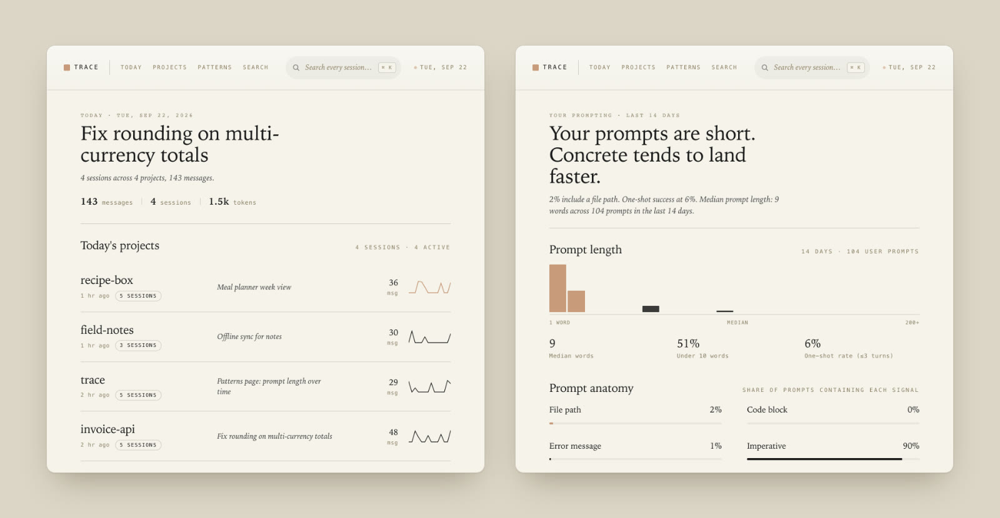

# Trace



Trace reads the session files Claude Code writes to `~/.claude/projects/` and turns them into a dashboard: what you worked on today, every prompt in them searchable, and how your prompting changes over time.

It's built for one person on one machine. Your sessions never leave your Mac, and the database lives at `~/Trace/trace.db`.

<sub>The screenshots above use made-up sessions.</sub>

## What you get

- **Today.** Each project you touched, its latest session and a sparkline of the day.
- **Search.** Full-text search across your prompts, with the match highlighted.
- **Projects.** Everything you're building side by side, sorted by last activity.
- **Patterns.** Prompt length, how often a prompt lands first time, what your prompts contain (file paths, error messages, questions) and the phrases you use when you redirect Claude.

A watcher tails the session files as Claude Code writes them, so the dashboard fills in while you work.

## Run it

```bash
pnpm install
pnpm dev
```

That starts the watcher and the dashboard at http://localhost:3000. Use Node 22. If pnpm says it skipped build scripts, run `pnpm approve-builds` and allow `better-sqlite3`.

## Status

Pre-v1. Today, Search, Projects, Project detail and Patterns work. Session detail is still a stub.

## How it's built

Node 22 and strict TypeScript in a pnpm workspace. SQLite through `better-sqlite3` and Drizzle, FTS5 for search, chokidar for the watcher, and a Next.js 15 dashboard with Tailwind and a little Recharts.

```
apps/dashboard/   Next.js dashboard reading from SQLite
apps/watcher/     tails ~/.claude/projects/ and writes rows
packages/db/      schema, queries and migrations
packages/parser/  parses session lines and scores each prompt
packages/shared/  schemas, types and paths
```

The v1 design is in [`docs/superpowers/specs/2026-04-26-trace-design.md`](docs/superpowers/specs/2026-04-26-trace-design.md).

## License

MIT. See [LICENSE](LICENSE).
